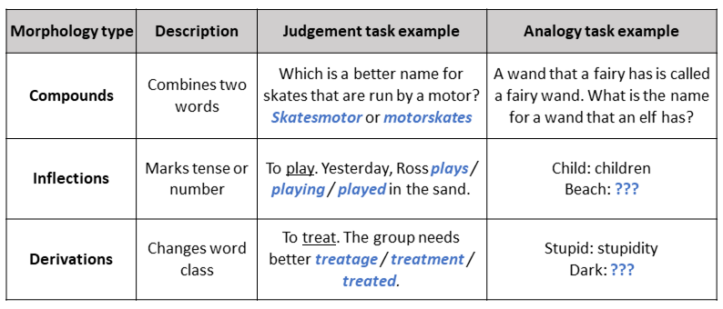

---
authors:
- admin
categories:
- Research summary
date: "2020-09-24T00:00:00Z"
draft: false
featured: false
image:
  caption: 'Image credit: [**creazilla**](https://creazilla.com/nodes/36842-kendra-girl-is-reading-a-book-clipart)'
  focal_point: "Bottom"
  placement: 2
  preview_only: true
lastmod: ""
projects: [ma-lancaster]
subtitle: ""
summary: "Lots of words are made up of smaller units of meaning, called *morphemes*. We measured children's awareness of morphemes, and looked at its importance for reading comprehension."
tags:
- Reading comprehension
- Morphology
- Morphological awareness
- Literacy development
- Poor comprehenders
title: "From little to large: the importance of understanding morphemes for understanding texts"
---

If you can bear to read the news at the moment, you will likely come across words you had no reason to encounter before 2020. How is it that we can so readily skim over new terms such as *maskless*, *super-spreader*, and *pre-lockdown*? Well, these words are each built from smaller units of meaning called morphemes. We know that *–less* means “without”, adding *–er* refers to a person that does something, and *pre-* means “before”. This awareness of morphemes can help us understand language even when words are unfamiliar. Thus, morphological awareness likely helps developing readers as they face increasingly challenging texts. We put this proposal to the test in our recent study of reading comprehension in 6- to 13-year-old children. 

We designed six tasks to assess three different types of morphology: compounds, inflections, and derivations (described in the table below). We assessed awareness of each type in two ways. In one task, children chose the most appropriate transformation between options. In the other, children produced a morphological transformation themselves. The tasks included both real and made-up words, to make sure they were measuring more than just vocabulary knowledge. 

 

Across all three age groups (6-8 years, 9-11 years, 12-13 years), children’s morphological awareness scores were strongly related to their reading comprehension ability. The crucial test was to see whether morphological awareness explained differences in reading comprehension over and above other important skills, such as phonological awareness (the ability to isolate and manipulate sounds in words), vocabulary, nonverbal reasoning, and reading accuracy. For the 6-8 and 12-13 year olds, we found that morphological awareness further improved the prediction of reading comprehension.

There was also some indication that morphological awareness was particularly important for children with weak comprehension, whereas vocabulary was a stronger predictor for good comprehenders. However, these differences were small and not clear-cut. All in all, both morphological awareness *and* vocabulary played important roles in reading comprehension across the spectrum. 

So this study shows that morphological awareness does have a unique role to play in reading comprehension: it adds something more to comprehension ability than the skills we typically measure in the classroom. Importantly, it predicts reading comprehension from beginning readers to adolescents, and across a wide range of abilities. This finding illustrates the importance of incorporating morphology instruction throughout literacy development.

*This post was a summary of: The relations between morphological awareness and reading comprehension in beginner readers to young adolescents. James, Currie, Tong, & Cain (2020), Journal of Research in Reading. [https://doi.org/10.1111/1467-9817.12316](https://doi.org/10.1111/1467-9817.12316) (open access)*