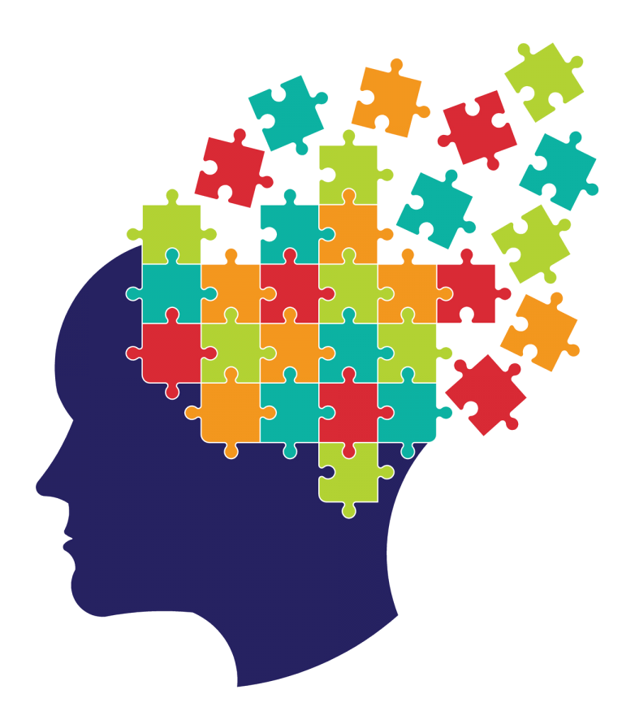

---
authors:
- admin
categories:
- Research summary
date: "2020-05-22T00:00:00Z"
draft: false
featured: false
image:
  caption: 'Image credit: [**subpng**](https://www.subpng.com/png-6i9ytj/)'
  focal_point: "Bottom"
  placement: 2
  preview_only: true
lastmod: ""
projects: [phd-work]
subtitle: "Why do some children excel at vocabulary learning while others get left behind? In recent work, we’ve been thinking about how new word learning builds upon vocabulary we already have."
summary: Why do some children excel at vocabulary learning while others get left behind? We’ve been thinking about how new word learning builds upon vocabulary we already have.
tags:
- Vocabulary
- Word learning
- Prior knowledge
- Sleep
title: 'The Puzzle of Vocabulary Growth'
---

Think about doing a jigsaw puzzle. Progress is often slow to begin with. It takes a while to work out how the thousands of tiny pieces fit within the bigger picture. A bit further down the line, you might have an outline. You've clustered some pieces together in their approximate space. The further you get in building the framework, the easier it becomes for you to place each individual piece. This phenomenon is true of learning new topics too --- we build cognitive frameworks that make it easier to learn related information. Yet, we don't know much about how language learners use their prior knowledge. We looked back at previous experiments to ask: do children with better vocabulary knowledge find it easier to learn new words?

To look at this question, we re-analysed data from five experiments of word learning in children. Each experiment involved teaching children some made-up words (for example, *dolpheg*) that were similar to real words in English (*dolphin*). Researchers then tested whether the two words became integrated in vocabulary. The integration task measured how quickly the children could detect a short pause inserted into the real words (e.g., *dolph__in*), to see whether the made-up words were competing for recognition. When a new word is integrated into vocabulary, response times slow down. The studies each found that sleep was important for this integration to happen: the new words interfered with children’s ability to process real words only when tested the next day.

We re-analysed the data from these experiments to look at how word learning might depend on children's prior knowledge. Children’s prior knowledge was assessed using a separate vocabulary test. We found that children with weak prior knowledge were less likely to embed new words into vocabulary overnight. Children with better prior knowledge were more likely to integrate new and known words. So what might be happening differently for these children overnight?

When we first learn a new word, a region of the brain called the hippocampus creates a memory of it. It stores information about its sound, its meaning, and its connections to words we know. Those known words are stored in neocortical (outer) regions of the brain. During sleep, new memories are reorganised in the brain so that they too become part of this long-term knowledge. This is achieved by the hippocampus replaying and reactivating the new word memory. As a result, the connections between new and known words become stronger, and the new words become part of long-term vocabulary. We think that children with better prior knowledge can make more connections between new and known words during learning. With more connections, they experience bigger benefits from memory replay during sleep.

Children who have a better language framework seem to more readily lay down each word “piece” of the language puzzle overnight. However, there are many reasons why children who do well at vocabulary assessments might also do well on these measures of word learning. Our research is trying to understand this relationship better. Which aspects of learning benefit most from prior knowledge? Do adults rely on prior knowledge more than children? How can this help us to understand atypical language development? I’ll be addressing these questions in the coming months. By better understanding how children use their existing knowledge during word learning, we hope to better understand why some children lag behind in vocabulary growth. Our finding that existing knowledge supports later *integration* of new words into long-term memory tells us that the answer might lie beyond initial vocabulary instruction.

*This post was a summary of: Consolidation of vocabulary during sleep: The rich get richer? James, Gaskell, Weighall, & Henderson (2017), Neuroscience & Biobehavioral Reviews. [https://doi.org/10.1016/j.neubiorev.2017.01.054](https://doi.org/10.1016/j.neubiorev.2017.01.054)*

*A freely available version can be downloaded here: [http://eprints.whiterose.ac.uk/113350/1/NBB_review_paper.pdf](http://eprints.whiterose.ac.uk/113350/1/NBB_review_paper.pdf)*
