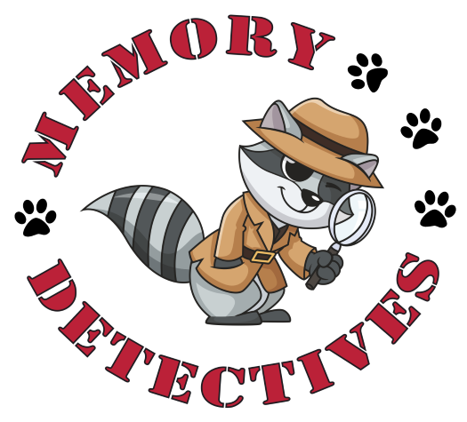

The events we experience contain lots of different types of information, such as where we are, the people we are with, and the objects around us. These details are bound together in our memory for the event, making it easy for us to remember the different elements together. For example, we might experience going to the park with a relative and finding a lost handbag there, and later find we remember that story upon visiting the park again. 

As a postdoc in the [York Episodic Memory Lab](http://www.aidanhorner.org/), I worked on a project trying to understand the processes that support this kind of memory, and how they change across development. We had to make some changes to the classic research tasks to make them child-friendly, which unintentionally ended up [telling us a bit about the processes involved in itself](https://psyarxiv.com/pd9us/)! The developmental aspect of the study is still ongoing.

